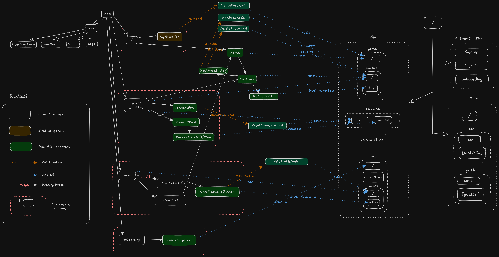

# Wink - Social Media App

Wink is a social media platform that focuses on user interaction and real-time communication. Users can post, comment, and connect seamlessly.

## Features

- User authentication via Clerk
- Interactive UI with Framer Motion
- Create Post, delete, edit and like.
- Share Muliple Images
- Create Profile, Follow others.
- Backend powered by Node.js and Prisma ORM.

## Libraries & Tools

- **Next.js** - Core framework
- **TypeScript** - Language support
- **Tailwind CSS** - Styling
- **Prisma** - Database ORM
- **UploadThings** - For Uploading Image

## Flowchart

The flowchart below shows the application's data flow:



## Installation

#####Clone the repository:

```bash
git clone https://github.com/YaIsrak/Wink.git
```

#####Install dependencies:

```bash
npm install
```

#####Set up environment variables in `.env`

#####Start the development server:

```bash
npm run dev
```

#####Open the app at `http://localhost:3000`.
